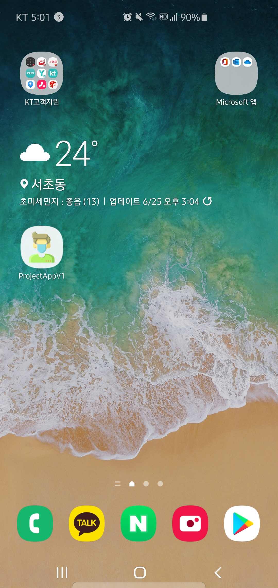
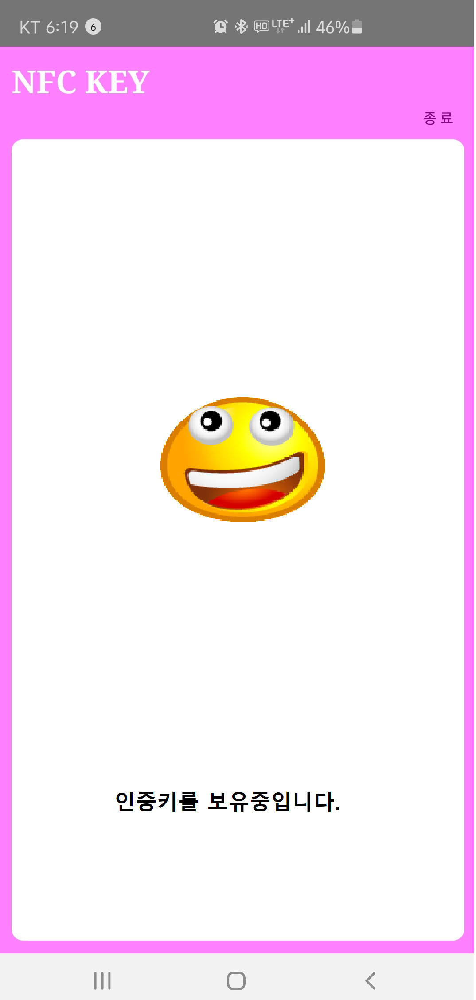
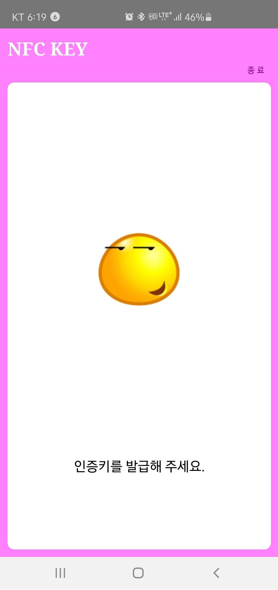
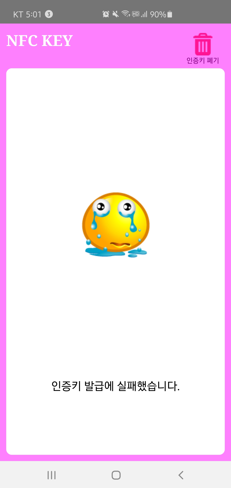
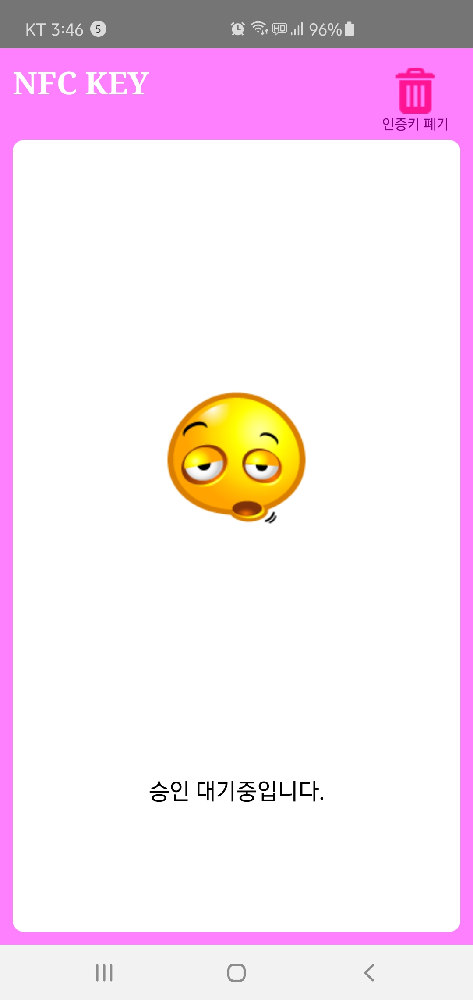
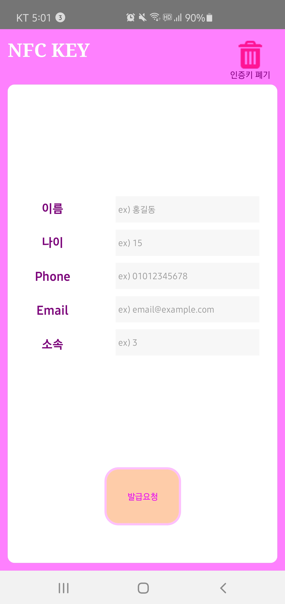
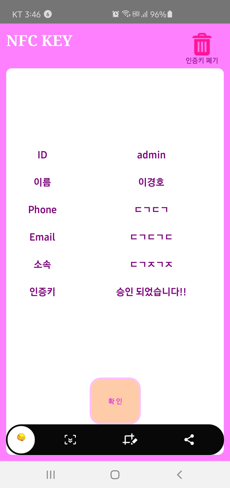

# Project Application Version 1.0

### 구현 사항
<p>NFC 모듈관련 기능을 제외한 기본적인 화면 View 구성과, View간의 전환로직, 버튼 클릭시 이벤트, 서버로의 요청처리 등을 구현하였다.</p>




<p>먼저 어플의 홈화면이다. 홈화면은 총 4가지의 상태를 갖는데,기본적인 구성은 다를게 없고, 특정 상태에 따라 상태메시지와 버튼을 클릭시의 이벤트에 차이가 생긴다.</p>



<p> 먼저 서버로부터 NFC 인증키를 전달받아서, 로컬영역에 NFC키와 인증 정보등을 보관하고 있는 상태이다. 이것이 "title1"이다. "title1"인 상태에서 인증키 폐기 버튼의 이벤트가 활성화되며, 중앙의 아이콘을 클릭하면, 인증키 정보가 조회 가능하다.</p>



<p>두번째는 아직 NFC 인증키 요청자체를 시행하지 않아서 인증키를 보유하지 않고 있는 상태이다. titleNO는 "title2"이다.중앙 아이콘 클릭시에 NFC인증키 발급에 필요한 기본적인 인적사항들을 입력할 수 있는 View로 전환된다.</p>


<p>세번째는 인증을 요청했지만, 네트워크 연결이 원활하지 않아서 요청처리 자체가 취소된 경우이다. 기본적으로 "title2"와 기능적인 면에선 차이가 없다. titleNo는 "title3"이다.</p>


<p>네번째는 인증키 요청을 진행한 이후, 아직 관리자로부터 승인이 나지 않은 상태이다. titleNo는 "title4"이며, 중앙의 아이콘을 클릭시엔 서버로부터 인증여부를 확인하고, 인증이 완료된 상태라면 title1에서 확인가능한 인증키정보화면으로 전환되며, 이때, 로컬저장소 상에 AsyncStorage 상에 인증정보를 저장한다.(내부적으로 sqlite이용) 인증이 완료되지 않은 상태라면 (미구현)toast로 미승인 상태임을 확인할 수 있게 구현할것이다.</p>


<p>title화면은 기본적인 구성은 공유했지만, 인증 요청화면과 인증키 정보 확인 화면은 살짝 다른구성을 취한다. 먼저 인증키 발급 화면이다. title2,3 인상태에서 아이콘 클릭시 나타나며, TextInput 이가능한 컴포넌트가 나타난다. 이를 모두 기입하고 발급 버튼을 누르면, 버튼이벤트에 지정된 네트워크로 post형식으로 요청한다. 이과정에선 별도로 돌려받은 response 데이터를 저장할 필요는 없다.</p>


<p>인증키 정보 확인 화면이다. 넘어오는 방법은 title1과 title4로부터 넘어올 수 있다. title1에선 이미 보유하여 메모리상에 로드되어있는 인증정보를 화면에 출력한다.
 title4에선 승인확인 요청의 응답으로 데이터가 넘어올 경우, response에서 nfc 인증사항등을 AsyncStorage로 로컬에 저장한다.</p>


 ### 코드 분석 및 유의사항

```javascript
import React, {Component} from 'react';
import {
  View,
  Text,
  Image,
  TextInput,        
  StyleSheet,
  TouchableOpacity, //☆
  AsyncStorage,     //☆
} from 'react-native';
import Axios from 'axios';//☆
```

<p>TouchableOpacity는 기존의 Button UI 컴포넌트를 대체하기 위해 사용되었다. Button으로 사용하게되면, 웹환경, ios환경, android 환경 모두에서 실행환경상 다루는 Button의 형태가 다양해진다. 그러므로 TOuchavleOpacity를 사용하여, 특정 영역 자체를 터치가 가능한 영역으로 만들어서 커스텀 button을 구현한다.</p>

<p>TextInput을 Axios는 웹서버로 http 요청을 작성하기 위한 모듈이다. 기본적으로 fetch라는 기능이 있지만, Axios가 더 사용하기 편리하다.</p>
 
<p>AsyncStorage는 사용자측에서 영구적으로 서비스를 이용하는동안 기록해야할 정보등을 저장하기 위한 기능을 제공하는 모듈이다.</p>

<p> 이것의 기원은 cookie, session이라 불리던 클라이언트의 정보, 혹은 연결정보등을 기록하는 텍스트파일이다. cookie와 session을 통해 자주 이용하는 사이트의 비밀번호나, 페이지 이동시의 로그인유지등을 이용할 수 있었다. 그러나 특정 파일형태로 기록되므로 보안에 취약하고, 용량제한이 있고, 텍스트 파일 형식이기 때문에, 프로그램에서 사용하기위해서 별도로 텍스트를 분할하여 메모리에 변수로 로드해야했다.
</p>

<P>이를 보완하고자 나온 개념이 HTML5 모던웹에서 기본기능으로 제공하는 LocalStorage이다. 기본적으로 역할은 cookie, session과 같지만, 용량의 허용범위가 더 크며, 딕셔너리  형태이므로, key값만 입력하면 원하는 데이터를 간편하게 로드하고 저장할 수 있다. 웹브라우저 차원에서 관리되며, 웹브라우저만이 사용가능한 일종의 DB 인셈이다.</P>

<p>리액트에서 이를 리액트 네이티브에서 LocalStorage 사용법 그대로 사용하기 위해 만든 개념이 AsyncStorage이다. 사용법은 LocalStorage와 거의 동일하며, 단지 네이티브 코드상에선 Anodroid는 sqlite, ios는 ios자체의 dictionary 타입의 파일을 이용한다. 사용법은 다음과 같다.</p>

```javascript
    AsyncStorage.setItem("등록할 단일 문자열 키값", 등록할 문자열 데이터);
    AsyncStorage.getItem("불러올 단일 문자열 키값");

    AsyncStorage.getItem("등록할 json데이터 키값",JSON.stringify(등록할 Json데이터));

    const b = AsyncStorage.getItem("json데이터");
    console.log(typeof b);
    //string

    const c = JSON.parse(b);
    console.log(typeof c);
    //json 객체

    const a = AsyncStorage.getAllKeys();
    //저장된 모든 데이터
    console.log(typeof a);
    //배열

    AsyncStorage.remoceItem("삭제할 키값");

```

<p>getAllkeys 명령을 통해 모든 키값을 불러올수는 있지만, 여러개의 데이터를 한번에 저장하기위해선 오로지 json으로만 가능하며 json을 하나의 단일 문자열화해서 하나의 key:value 쌍으로 저장가능하다.</p>

```javascript
  state = {
    //상태관련자들
    isLoading:true,//사용자 정보가 AsyncStorage에 있는지 없는지에 따라 타이틀화면이 결정되기 이전 로딩 화면출력
    isTitle:false, //로딩이 완료된 이후에 title화면으로 전환하기 위한 state
    isSent:null,
    isNfc:null,    //Nfc가 있다면 Key 정보조회, Nfc가 없으면 Key 발급기능 으로 결정
		titleNo:null,  //인증키가 있는지, 없는지, 실패했는지
    
    //Text Input 변수들
    name:"",       //TextInput에 입력하는 값을 저장.
    age:"",
    phone:"",
    email:"",
    company:"",

    //키발급 요청,실패
    error:null,      
    response:null,
    
    userInfo:{
      id:"",
      name:"",
      age:"",
      email:"",
      nfcKey:"",
      company:"",
    }, //발급성공시 응답으로 넘어온 데이터를 저장.
                   //이미 발급을 받은상태라면 앱 실행시 asyncStorage에서 로드
    nfcText:"",
	};
```
<p>별도 설명 생략</p>

```javascript
    //클래스 내부 메서드
  constructor(){
    super();
  }
  
  componentDidMount(){//loading화면으로 render가 진행된 이후부터, 키발급유무에 따라 title화면을 결정
    this.loadDatafromAsyncStorage();//AsyncStorage를 조회해서 타이틀화면결정하기위한 지정메서드
  }
```

#### 컴포넌트 생명주기

<p>

    컴포넌트 생성시
    최초화면 출력까지
    constructor -> 초기화
    componentWillMount -> render 이전
    render ->          -> 그리기
    componentDidMout   -> render 이후

    componentWillReciveProps -> props 변화 감지
    shouldComponentUpdate -> 여기서턴 state 변화가 감지시 일어나는부분, 이때, 변경된 state와 props에 의해 View에 변경점이 있을경우에만 다음단계 진행.

    ComponenWillUpdate -> ViewUpdate 진행이전 데이터 전처리

    render() -> 그림

    ComponentDidUpdate -> render 이후

    ComponentWillumount -> 컴포넌트가 더이상 렌더링되지 않을경우 
                        즉 사용된 모듈을 안전하게 종료실.

</p>


```javascript
 loadDatafromAsyncStorage = async () => {

    const userInfo = await AsyncStorage.getItem("userInf"); //"userInf"라는 키값으로 사용자정보를 로드
    const isSent = await AsyncStorage.getItem("isSent");//null이면 보낸적없고, true면 보낸거고, false면 보내서 이미 처리된거.

    console.log("User Infomation",userInfo);
    
    if (userInfo == null){   //userInf가 없으면
      if(isSent == null){
        this.setState({
          titleNo:"title2",   //키발급을 위한 2번타이틀화면으로 실행
          isLoading:false,    //로딩화면은 종료
          isTitle:true,       //타이틀화면으로 전환
          isNfc:false,        //userInf가 없기때문에 isNfc는 false
        });
      }else if (isSent == "true"){
        this.setState({
          titleNo:"title4",   //키발급을 위한 2번타이틀화면으로 실행
          isLoading:false,    //로딩화면은 종료
          isTitle:true,       //타이틀화면으로 전환
          isNfc:false,        //userInf가 없기때문에 isNfc는 false
        });
      }
      return false;
    }else{
      this.setState({//userInf가 있으면
        userInfo:JSON.parse(userInfo),//
        titleNo:"title1",       //키확인을 위한 1번타이틀화면으로 실행
        isLoading:false,        //로딩화면은 종료
        isTitle:true,           //타이틀화면으로 전환
        isNfc:true,             //userInf가 있기때문에 inNfc는 true
      });
      return true;
    }
  }  
```
<p>최초화면인 loading화면을 렌더링한 이후에, 타이틀화면을 어떤것으로 결정하는 메서드이다. 키값을 보유중이면 1번화면, 미보유중인데 신청을 한상태라면 4번화면, 미보유중이고 미신청상태면 2번화면이된다. asnycStorage 이름을 봐서 알듯이 비동기 함수이므로, 해당메서드를 async로 정의해야한다.</p>

```javascript
      _title = async () => {    //키확인 View에서 "확인"버튼을 눌러서 다시 타이틀로 전환하기 위한 메서드
   this.setState({
       isTitle:true,
    });
	}
```
<p>키 확인 화면에서 다시 타이틀화면으로 전환하기 위한 메서드</p>

```javascript
     _KeyReqServ = async () =>{//키 발급 화면에서 "발 급" 버튼을 눌러서 발급절차를 위한 메서드
    await Axios.post("http://192.168.1.50:5000/getSquare1",{ //post 방식으로 요청
      "number":5,//임시
      //name:this.state.name,
      //age:this.state.age,
      //phone:this.state.phone,
      //email:this.state.email,
      //company:this.state.company,
    })
    .then(response=>{
      this.setState({
        response:response["data"]["answer"],   
        isTitle:true,     
        isNfc:false,
        titleNo:"title4",
        //name:"",
        //age:"",
        //phone:"",
        //email:"",
        //company:"",
      });
      AsyncStorage.setItem("isSent","true");
        //이걸해야 , 승인대기 상태에서 종료된이후 재시작해도 승인대기를 유지한다.
    })
    .catch(error=>{           //에러시
      console.log("error :", error);  //출력
      this.setState({
        error:error,        //에러 저장. 3번 화면에 출력예정.
        titleNo:"title3",   //에러시 title View
        isTitle:true,       //타이틀로전환
        name:"",          //TextInput 입력값들 초기화
        age:"",
        phone:"",
        email:"",
        company:"",
      })
    })
	}
```
<p>키 발급화면에서, 발급버튼을 눌렀을때이다.서버의 요청 url을 보내며, 요청수리를 했을경우 .then이 실행되어 승인대기 상태인 title 4로 만들고, 요청이 실패하면 title3 가된다.</p>

```javascript
isKeyReqAccept = async () => {
    await Axios.post("http://192.168.1.50:5000/getSquare2",{
      "number":6,
    })
    .then(response=>{
      if(response["data"]["answer"] == 36){
       //var userInf = response["answer"] 
       //이렇게 지정하지말고, 서버로 넘겨받은 response에서 추출해야한다.
       var userInf = {   
         id:"admin",
         name:"이경호",//현재는 내가 입력한걸 하고있는데, 실제론 어차피 서버에서 전달됨. 지금은 테스트를 위함이고,그래서 껐다켠상태에서 승인대기화면에서 이게 null이어도 상관없ㅇ므

         phone:"01054414445",
         email:"purplight2m@gmail.com",
         company:"Company 1",
         nfcKey:"00000000000000000000000000000000000000000000001234",
       }
      
        AsyncStorage.setItem("userInf",JSON.stringify(userInf));
        AsyncStorage.removeItem("isSent");
        this.setState({     
          response:response,
          isTitle:false,     
          isNfc:true,
          titleNo:"title1",
          userInfo:userInf,
          name:"",     
          age:"",
          phone:"",
          email:"",
          company:"",
          nfcText:"승인 되었습니다!!"
        });
      }
    })
    .catch(error=>{           //에러시
      console.log("error :", error);  //출력
      this.setState({
        titleNo:"title4",   //에러시 title View
        isTitle:true,       //타이틀로전환
        // name:"",          //TextInput 입력값들 초기화
        // age:"",
        // phone:"",
        // email:"",
        // company:"",
      });
      titleCases["title4"].title = ""
    });
  }
```
<p> 4번화면에서 요청 승인상태를 확인하기 위한 메서드이다. 서버의 승인확인 url로 요청을하며,  성공시에 key정보를 받아들여 asyncstorage에 저장한다. 실패시엔 toast 메시지로 미승인상태임을 출력하는 기능을 구현할것이다.
</p>

```javascript
 render(){
    
    return(
    <View style={styles.container}>
      <View style={styles.header}>
			<Text style={styles.headerText}>NFC KEY</Text>
			<View style={styles.headerBtn}>
        <TouchableOpacity 
        style={{alignItems:"center"}}
        onPress={(this.state.isTitle && this.state.titleNo=="title1")? (async () => {
          this.setState({
            isNfc:false,
            isTitle:true,
            titleNo:"title2",
            // name:"",          //TextInput 입력값들 초기화
            // age:"",
            // phone:"",
            // email:"",
            // company:"",
          });  
          await AsyncStorage.removeItem("userInf");

        }):(null)}>
          <Image source={require("./image/trash.png")}/>
          <Text style={{color:"purple"}}>인증키 폐기</Text>
        </TouchableOpacity>
			</View>
		</View>                 
    {this.state.isLoading?(
    <View style={styles.body}>
      <View style={styles.upper}>
      </View>
      <View style={styles.lower}>
        <Text>is Loading</Text>
      </View>
    </View>
    ): (this.state.isTitle? (
      <View style={styles.body}>
        <View style={styles.upper}>
          {this.state.titleNo=="title4"?
          <TouchableOpacity 
            style={titleCases[this.state.titleNo].BtnStyle}
            onPress={()=>{this.isKeyReqAccept()}}>
            <Image source={titleCases[this.state.titleNo]["imageSrc"]}/>
          </TouchableOpacity>
          :
          <TouchableOpacity 
            style={titleCases[this.state.titleNo].BtnStyle}
            onPress={()=>{this.setState({isTitle:false, nfcText:"인증키를 보유중입니다."})}}>
            <Image source={titleCases[this.state.titleNo]["imageSrc"]}/>
          </TouchableOpacity>
          }
        </View>
        <View style={styles.lower}>
          <Text style={styles.titleText}>
            {titleCases[this.state.titleNo].title}
          </Text>
        </View>  
      </View>
        ):(this.state.isNfc?(
      <View style={styles.body}>
        <View style={styles.upper}>
          <View style={styles.left}>			
            <Text style={styles.infoText}>ID</Text>
            <Text style={styles.infoText}>이름</Text>
            <Text style={styles.infoText}>Phone</Text>
            <Text style={styles.infoText}>Email</Text>
            <Text style={styles.infoText}>소속</Text>
            <Text style={styles.infoText}>인증키</Text>
          </View>
          <View style={styles.right}>
            <Text style={styles.infoText}>{this.state.userInfo["id"]}</Text>
            <Text style={styles.infoText}>{this.state.userInfo["name"]}</Text>
            <Text style={styles.infoText}>{this.state.userInfo["phone"]}</Text>
            <Text style={styles.infoText}>{this.state.userInfo["email"]}</Text>
            <Text style={styles.infoText}>{this.state.userInfo["company"]}</Text>
            <Text style={styles.infoText}>{this.state.nfcText}</Text>
          </View>
        </View>
        <View style={styles.lower}>
          <TouchableOpacity onPress={this._title} style={styles.confirmBtn} >
            <Text style={{color:"magenta"}}>
              {"확 인"}
            </Text>
          </TouchableOpacity>
        </View>
      </View>
        ):(
      <View style={styles.body}>
        <View style={styles.upper}>
          <View style={styles.left}>			
            <Text style={styles.infoText}>이름</Text>
            <Text style={styles.infoText}>나이</Text>
            <Text style={styles.infoText}>Phone</Text>
            <Text style={styles.infoText}>Email</Text>
            <Text style={styles.infoText}>소속</Text>
          </View>
          <View style={styles.right}>
            <TextInput style={styles.inputText} onChangeText={text=>{this.setState({name:text});}}
            placeholder="ex) 홍길동"
            value={this.state.name}/>
            <TextInput style={styles.inputText} onChangeText={text=>{this.setState({age:text});}}
            placeholder="ex) 15"
            value={this.state.age}/>
            <TextInput style={styles.inputText} onChangeText={text=>{this.setState({phone:text});}}
            placeholder="ex) 01012345678"
            value={this.state.phone}/>
            <TextInput style={styles.inputText} onChangeText={text=>{this.setState({email:text});}} 
            placeholder="ex) email@example.com"
            value={this.state.email}/>
            <TextInput style={styles.inputText} onChangeText={text=>{this.setState({company:text});}} 
            placeholder="ex) 3"
            value={this.state.company}/>
          </View>
        </View>
        <View style={styles.lower}>
          <TouchableOpacity onPress={this._KeyReqServ} style={styles.confirmBtn} >
            <Text style={{color:"magenta"}}>
              {"발급요청"}
            </Text>
          </TouchableOpacity>
        </View>
      </View>
      )))}
   
    </View>
    );
  }
}
```
<p>실제 화면구성을 위한 render 이다.</p>

```javascript

const styles = StyleSheet.create({
	container:{
		backgroundColor:"#FF80FF",
    flexDirection:"column",
    flex:1,
    padding: 11,
	},
	header:{
    flex:1,
    flexDirection:"row",
		alignContent:"center",
	},
	headerText:{
    flex:2,
    color:"white",
    fontSize:30,
    fontWeight:"bold",
    fontFamily:"times",
    justifyContent:"center",
  },
  headerBtn:{
    flex:2,
    color:"#999922",
    padding:10,
    alignItems:"flex-end",
    justifyContent:"center",
  },
	body:{
    flex:10,
    flexDirection:"column",
    backgroundColor:"white",
    borderRadius:10,
	},
	upper:{
		flex:4,
    flexDirection:"row",
    justifyContent:"center",//수직정렬
    alignItems:"center",
  },
	lower:{
    flex:1,
    alignItems:"center",
  },
  titleText:{
    fontSize:23,
  },
	left:{
    flex:1,
    justifyContent:"center",//수직정렬
    alignItems:"center",
	},
	right:{
    flex:2,
    justifyContent:"center",//수직정렬
    alignItems:"center",
  },
  infoText:{
    margin : 12,
    fontSize : 20,
    fontWeight: "bold",
    color:"purple",
  },
  inputText:{
    backgroundColor:"#f7f7f7",
    width:"80%",
    marginTop:5,
    marginBottom:5,
    paddingTop:5,
    paddingBottom:5,
  },
	titleBtn1:{
    flex:1,
    marginStart:"30%",
    marginEnd:"30%",
    height : "40%",
    justifyContent:"center",//수직정렬
    alignItems:"center",
    //backgroundColor : "blue",

	},
	titleBtn2:{
    flex:1,
    width:"40%",
    height : "40%",
    justifyContent:"center",//수직정렬
    alignItems:"center",
    //backgroundColor : "gray",
	},
	titleBtn3:{
    flex:1,
    width:"40%",
    height : "40%",
    justifyContent:"center",//수직정렬
    alignItems:"center",
    //backgroundColor : "red",
  },
  titleBtn4:{
    flex:1,
    width:"40%",
    height : "40%",
    justifyContent:"center",//수직정렬
    alignItems:"center",
    //backgroundColor : "red",
  },
  confirmBtn:{
    backgroundColor:"#ffccaa",
    padding:30,
    borderRadius:20,
    borderColor:"#FFbfFF",
    borderWidth:3,
    borderStyle:"solid",
  }
});

const titleCases = {
	title1:{
  	BtnStyle : styles.titleBtn1,
    title:"인증키를 보유중입니다",
    imageSrc:require("./image/Nfc.png"),
	},
	title2:{
    BtnStyle : styles.titleBtn2,
    title:"인증키를 발급해 주세요.",
    imageSrc:require("./image/noNfc.png"),
	},
	title3:{	
    BtnStyle : styles.titleBtn3,
    title:"인증키 발급에 실패했습니다.",
    imageSrc:require("./image/failNfc.png"),
  },
  title4:{	
    BtnStyle : styles.titleBtn4,
    title:"승인 대기중입니다.",
    imageSrc:require("./image/waitNfc.png"),
  },
};
```

<p>css를 대신할 styleSheet와 title화면을 결정할 titlecases 이다.</p>

